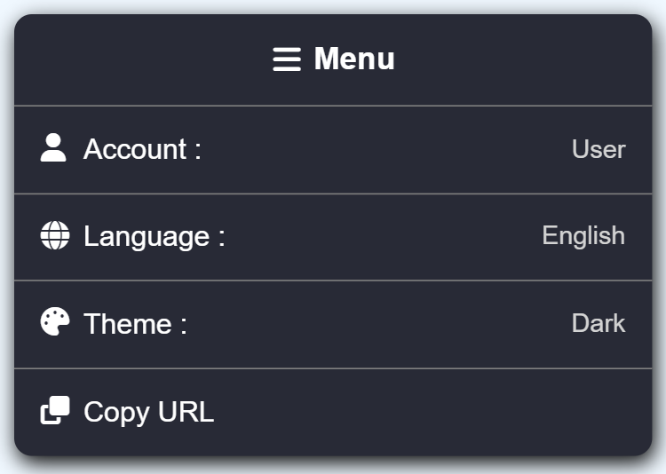

# SwipeMenu_JS

<p align="center">
  
</p>

<p align="center">
	<a href="examples/swipe_menu.html">Usage Example</a> | 
	<a href="https://superzombi.github.io/SwipeMenu_JS/examples/swipe_menu.html">Preview</a>
</p>

### Usage:

#### 1) Import required files.
```html
<head>
    <link href="https://superzombi.github.io/SwipeMenu_JS/swipe_menu.css" rel="stylesheet">
    <script src="https://superzombi.github.io/SwipeMenu_JS/swipe_menu.js"></script>
</head>
```

#### 2) Create a `div` with class `swipe-menu`.
```html
<div class="swipe-menu">

</div>
```

#### 3) Inside this div, create an element for the `back button`.
```html
<div class="swipe-menu">
	<div class="back_button">
		Back
	</div>
</div>
```

#### 4) Create `ul` with main `menu`. You can also create a `menu title` inside of it and provide links to `submenu`.
```html
<div class="swipe-menu">
	<div class="back_button">Back</div>

	<ul class="menu">
		<li class="menu_title">
			Menu
		</li>
		<li submenu="language">
			Language
		</li>
		<li submenu="theme">
			Theme
		</li>
	</ul>
</div>
```

#### 5) Create a `submenus`.
```html
<div class="swipe-menu">
	...

	<ul class="submenu" name="theme">
		<li class="menu_title">
			Theme:
		</li>
		<li value="light">
			Light
		</li>
		<li value="dark">
			Dark
		</li>
	</ul>
</div>
```

#### 6) Initialize SwipeMenuJS.
```javascript
var myMenu = document.getElementById("myMenu")
swipeMenu(myMenu)
```

#### 7) Set the default value.
```javascript
myMenu.init('language', 'en')
```
You can also track the value change and call the callback.
```javascript
myMenu.init('theme', 'dark', onchange=(target, old_element)=>{
    document.body.classList.remove(old_element.getAttribute("value"))
    document.body.classList.add(target.getAttribute("value"))
})
```

<p align="center">
	<a href="examples/example.html">Full Example</a> | 
	<a href="https://superzombi.github.io/SwipeMenu_JS/examples/example.html">Preview</a>
</p>

#### 8) You can also update the value.
```javascript
myMenu.update('language', 'ru')
```

#### 9) If you need, you can close all submenus.
```javascript
myMenu.exitAllSubMenus()
```

#### 10) To insert a link, you must specify the `href` attribute.
```html
<li href="#account">
	Account
</li>
```
You can also add `target="_blank"`.

#### 11) To add a selected value for an element that does not have a submenu, specify a name for it.
```html
<li name="account">
	Account
</li>
```

#### 12) To display selected values on the right, specify the class `space-between` for `swipe-menu`.
```html
<div class="swipe-menu space-between">

</div>
```

#### 13) If you want the menu to be swiped from the right, specify this at <a href="#6-initialize-swipemenujs">initialization</a>.
```javascript
var myMenu = document.getElementById("myMenu")
swipeMenu(myMenu, 'right')
```

<hr>

#### <a href="https://www.donationalerts.com/r/super_zombi">Support the project</a>
